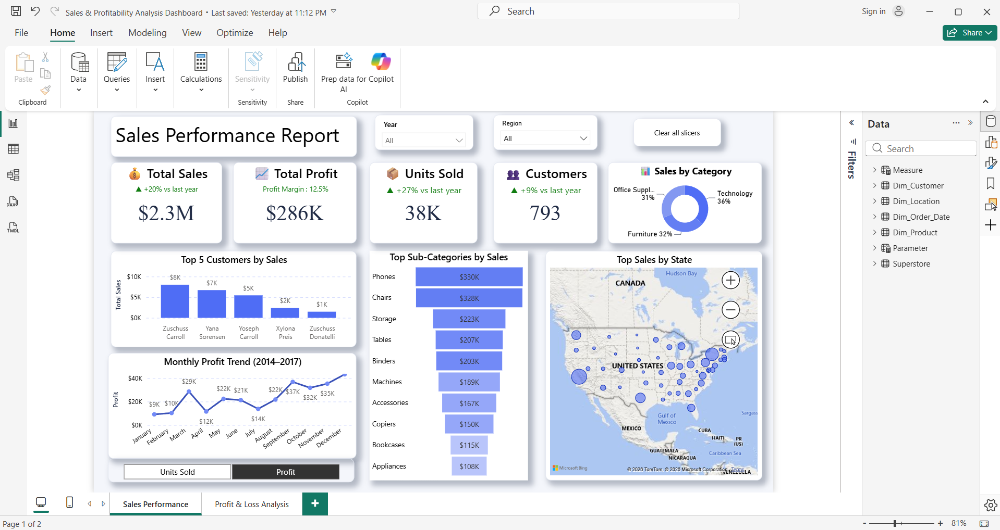

# 📊 Sales & Profitability Analysis Dashboard | Power BI

An interactive two-page Power BI report analyzing sales and profitability for a 
retail superstore (2014–2017). Built to turn raw transaction data into clear, 
actionable business insights for stakeholders.

---

## 🎯 Business Questions Answered

- How are sales and profit trending year over year?
- Which products, categories, and regions drive the most revenue?
- Where is the business losing money — and why?

---

## 📈 Dashboard Pages

### 1️⃣ Sales Performance Report

KPI cards (Total Sales, Profit, Units Sold, Customers) with **year-over-year 
comparisons**, sales by category, top customers and sub-categories, monthly 
profit trend, and a geographic sales map.

### 2️⃣ Profit & Loss Analysis Report

A deep dive into **what's eating the profit**: discount impact on margins, 
profit by order quantity tier and delivery speed, plus a scatter plot that 
pinpoints loss-making sub-categories.

---

## 🔍 Key Insights & Recommendations

- 📉 **High discounts destroy profit** — high-discount orders flipped from +$331K to –$77K. *Cap discounts on low-margin items.*
- 💰 **Healthy overall margin** — 12.5% profit on $2.3M in sales.
- ⚠️ **Loss orders rising** — up +38% vs last year. *A key risk area to monitor.*
- 🚚 **Slow deliveries underperform** — just 19% of profit vs 55% from normal speed. *Investigate overlap with deep discounts.*
- 📦 **Bulk ≠ profit** — high-quantity orders earned $45K vs $138K from medium orders.
- 🏆 **Profit drivers identified** — Copiers (37%) and Accessories (25%) lead margins. *Scale these categories.*
- ⚙️ **Loss-making products flagged** — Tables, Machines, and Bookcases sell well but lose money. *Review pricing.*
---

## 🛠️ Tools & Skills Demonstrated

| Skill | How I Used It |
|-------|---------------|
| **Power BI** | Data modeling, report layout, interactive slicers |
| **DAX** | Year-over-year measures, KPI calculations, conditional formatting |
| **Data Visualization** | Choosing the right chart for each business question |
| **Data Storytelling** | Structuring two pages from overview → root-cause analysis |

---

## 📂 How to Explore

Download `Sales & Profitability Analysis Dashboard.pbix` and open it in 
**Power BI Desktop** to interact with the slicers and visuals yourself.

**Dataset:** Sample Superstore (2014–2017)

---

⭐ *If you found this project interesting, feel free to star the repo!*
